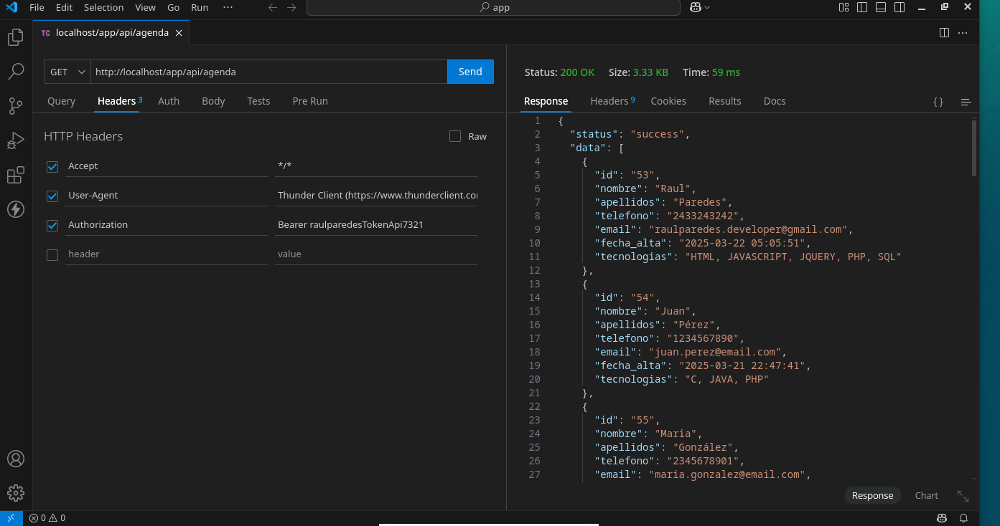
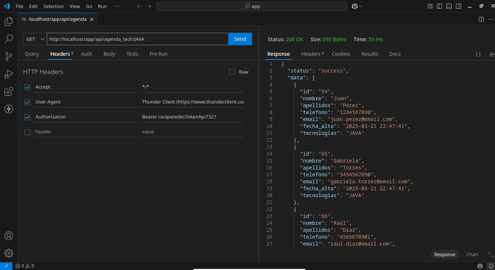

# Agenda Programadores

## Descripción

Se requiere desarrollar una aplicación web en la que se pueda capturar una lista de programadores para llevar una agenda de los mismos. Para cada programador se registraran sus datos de contacto y lenguajes de programación y/o tecnologías que maneja.

## Requerimientos

- **Fase 1**:

1. Acceso seguro a través de un usuario y contraseña. 

La veracidad del correo electrónico deberá ser validada usando el API de mailboxlayer.com

2. Deberá permitir las funciones CRUD (Create, Read, Update, Delete) para los programadores.

3. Al crear un nuevo contacto (programador) se deberán capturar los siguientes datos: Nombre, Apellidos, Teléfono y Correo Electrónico. Y opcionalmente se podrá cargar una foto para el contacto.

4. Deberán poder seleccionarse 1 o más desde un catálogo que tendrá opciones como: C, SQL, JAVA, PHP, PYTHON, NODEJS, JAVASCRIPT, HTML, CSS, C#, PERL, C++, R, GO, JQUERY...

5. Deberá permitir buscar contactos basados en la selección de un lenguaje o tecnología, es decir, al seleccionar JAVA se mostrarán todos los programadores que conocen JAVA.

6. Contará con 2 reportes disponibles: el primero mostrará la cantidad de programadores por lenguaje y el segundo; al seleccionar un mes y año mostrará la cantidad de programadores que se han capturado por día del mes. De ser posible los reportes deberán presentar una gráfica que muestre esos datos.

- **Fase 2**:

## API.

1. Solicitar la lista de desarrolladores completa.
- Metodo **GET  app/api/agenda/**

2. La lista de desarrolladores que conocen de 1 lenguaje en particular.
- Metodo **GET app/api/agenda_tech/PHP**

## Relaciones.

+-------------------+      +------------------------+      +----------------+
|   programadores   |      |tecnologias_programador |------|  tecnologias   |
|-------------------|      |------------------------|      |----------------|
| id (PK)           |---|  | id (PK)                |  |---| id (PK)        |
| nombre            |   |--| programador_id (FK)    |  |   | tecnologia     |
| email             |      | tecnologia_id (FK)     |--|   | status         |
| telefono          |      +------------------------+      +----------------+
| foto              |
| fecha_alta        |
| fecha_update      |
| status            |
+-------------------+

